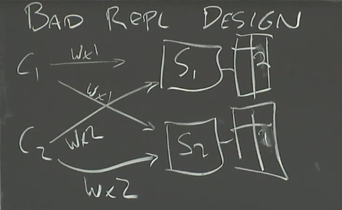
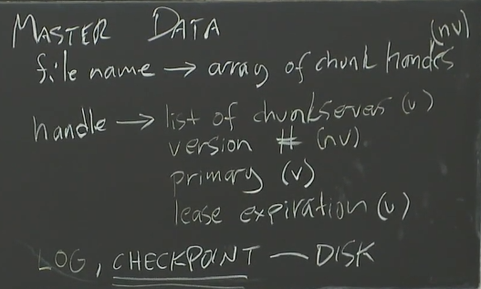

# MIT 6.824： Distributed Systems
Youtube 链接: https://www.youtube.com/watch?v=cQP8WApzIQQ&list=PLrw6a1wE39_tb2fErI4-WkMbsvGQk9_UB&index=1&ab_channel=MIT6.824%3ADistributedSystems  
  
Lab的地址: https://pdos.csail.mit.edu/6.824/  
  
某位大佬的博客: https://yuerblog.cc/2020/08/13/mit-6-824-distributed-systems-%e5%ae%9e%e7%8e%b0raft-lab2a/

## Lecture 1 Introduction
 1. 能用一台机器解决的问题，就不要用分布式
 2. Scalability - 2x Computers -> 2x Throughput
 3. Fault Tolerance:
     - Availability
     - Recoverability:
        - NV(non-volatile storage) Storage： 断电后能恢复，但是代价昂贵，expensive to update, 应该避免使用
        - Replication: identical servers 推荐
     - Strong Consistency: 非常expensive, 不推荐 10ms网络延迟communication cost, 能丢失百万条指令
     - **Weak** Consistency: 推荐
 4. MapReduce:
    - Reduce这一块要用到网络通信，网络通信要消耗带宽，如果有10TB文件要MapReduce，则Reduce阶段要在网络中发送10TB，最后产出10TB，网络消耗非常大
 5. 分布式系统要用到很多的网络通信，网络这一块很重要

## Lecture 2&3 RPC and Threads & GFS
 1. MIT推荐书籍**Effective Go**
 2. ```go run -race xxx.go```可以用来进行竞争检查
 ```go
 ch := make(chan []string)
 for urls := range ch{
    update ch // 这个for可能永远都不会停止
 }
 ```
   
 S1和S2处理C1、C2请求的(时间)顺序不同，出现不同的结果，没有consistency，所以是bad design  
 1. GFS是在一个Data center里，而不是全球都有around the world
 2. GFS是Big sequential access, 就是GB、TB大文件，而不是random的  
 3. GFS是基于Master Worker的，Master DATA见下图
 
  
 
