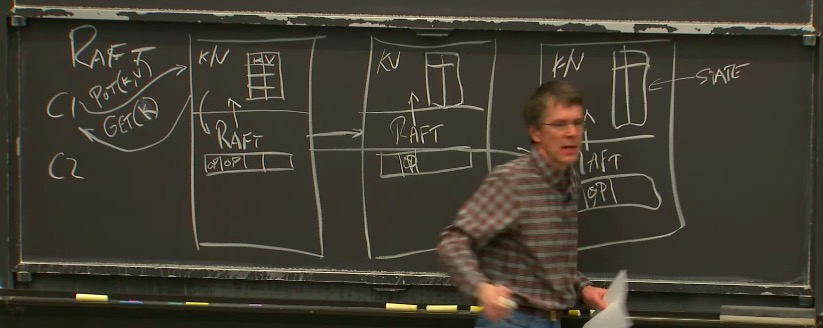
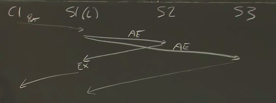
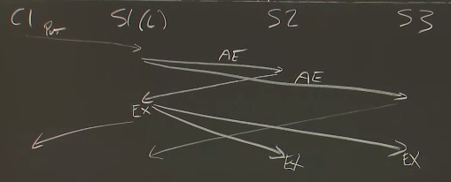
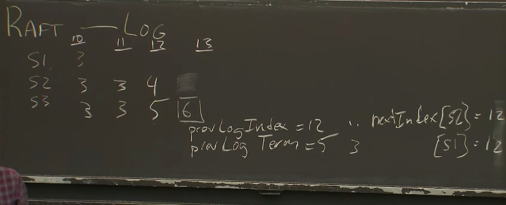
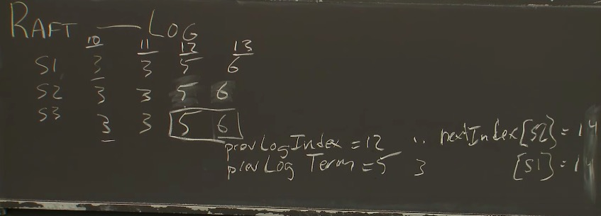

# MIT 6.824： Distributed Systems
**本Repo记录了MIT 6.824课程相关的笔记以及收集了RAFT相关好的文章和视频**
  
**课程**Youtube 链接: https://www.youtube.com/watch?v=cQP8WApzIQQ&list=PLrw6a1wE39_tb2fErI4-WkMbsvGQk9_UB&index=1&ab_channel=MIT6.824%3ADistributedSystems  
  
**课程**Lab的地址: https://pdos.csail.mit.edu/6.824/  
  
Raft**诞生的论文**(为什么要Raft, Paxos为什么不好)(论文里的Figure 2真的很重要): https://pdos.csail.mit.edu/6.824/papers/raft-extended.pdf
  
**Raft作者亲自讲解**Raft: https://www.youtube.com/watch?v=vYp4LYbnnW8&t=94s&ab_channel=DiegoOngaro
  
一个不错的Raft文章(适合新手): https://kasunindrasiri.medium.com/understanding-raft-distributed-consensus-242ec1d2f521
  
Raft**动画在线演示**(易于理解): http://thesecretlivesofdata.com/raft/
  
某位国内大佬的博客(里面有lab实现): https://yuerblog.cc/2020/08/13/mit-6-824-distributed-systems-%e5%ae%9e%e7%8e%b0raft-lab2a/
  
根据课程规定，本Repo将不会公开MIT-6.824 Lab相关的代码和解决方案，以鼓励更多的优质课程开源分享  
According to the course rules and code of conduct, the Lab code and solution associated with the MIT-6.284 course will not be open sourced in order
to encourge sharing of high quality courses like this.
  
## Lecture 1 Introduction
 1. 能用一台机器解决的问题，就不要用分布式
 2. Scalability - 2x Computers -> 2x Throughput
 3. Fault Tolerance:
     - Availability
     - Recoverability:
        - NV(non-volatile storage) Storage： 断电后能恢复，但是代价昂贵，expensive to update, 应该避免使用
        - Replication: identical servers 推荐
     - Strong Consistency: 非常expensive, 不推荐 10ms网络延迟communication cost, 能丢失百万条指令
     - **Weak** Consistency: 推荐
 4. MapReduce:
    - Reduce这一块要用到网络通信，网络通信要消耗带宽，如果有10TB文件要MapReduce，则Reduce阶段要在网络中发送10TB，最后产出10TB，网络消耗非常大
 5. 分布式系统要用到很多的网络通信，网络这一块很重要

## Lecture 2&3 RPC and Threads & GFS
 1. MIT推荐书籍**Effective Go**
 2. ```go run -race xxx.go```可以用来进行竞争检查
 ```go
 ch := make(chan []string)
 for urls := range ch{
    update ch // 这个for可能永远都不会停止
 }
 ```
   
 S1和S2处理C1、C2请求的(时间)顺序不同，出现不同的结果，没有consistency，所以是bad design  
 1. GFS是在一个Data center里，而不是全球都有around the world
 2. GFS是Big sequential access, 就是GB、TB大文件，而不是random的  
 3. GFS是基于Master Worker的，Master DATA见下图
 4. version 表示最新的版本 write的时候要比较，然后在最新的版本append
 
 
   
 以下是GFS write时的操作，左边INCREMENT V#是指Master increment, 右边如果primary returns "no" to client, 则client会继续发起这个写请求
 直到成功为止，Google好像并没有提不成功的情况  
   
  - **GFS没有Strong Consistency, 所以存的东西可能丢失、重复！**
  - 如果Pimary挂了，在Secondary选举为新的Primary后，要进行同步Sync, 因为可能有Last set operation有的做了有的没做
  - GFS使用单一节点作为Master，其实是有问题的，出现Out of Memory RAM，所有东西都在内存里，加内存不够
   
 ## Lecture 4 Primary-Backup Replication 主从复制
  1. **State transfer**: Primary sends state to the secondary(Sync) e.g Send memory to the backup.
      - sends **memory**
  2. **Replicated State Mache**: Assuming state transfer is deterministic unless there are external factors. Thus, Primary do not send state, instead , it sends
  external factors to the secondary (backup).
      - sends **operations from client**
  3. What state? 主从复制考虑的问题
      - Primary/Backup Sync 主从同步
      - Cut-over 主从转换，比如主机挂了需要提升一个新的主机
      - Anomalies 外界不应该感知到主机挂了
      - New replicas 备份从挂了，也需要一个新的备份
  4. 一般情况下是Primary收到一条指令(packet?)，然后发给Backup也执行这条指令(packet)，但是有一些指令是weird instructions比如获取当前时间，获得进程ID，随机数之类的，
  在主和从会产生不同的结果，这种情况下从需要等主执行完后将结果告诉它
  5. **Output Rule**: Primary can not generate output(ACK) to the client until all the backups generate output to the primary.
  6. 一般情况下，client和Primary以及Secondary连接使用**TCP协议**，Primary把TCP包转给Secondary，回复ack时会把**tcp Sequence number**带上，所以
  如果client收到两份ack(primary and secondary）通过查看Seq，会把第二个Secondary发的给drop掉
  7. **Split Brain**(脑裂)的解决：让第三方authority来确定谁是Primary, 有一个TEST-AND-SET Server，让左脑和右脑同时发送test-and-set命令给这个Server，
  Server先收到谁的命令就让谁set为真正的Primary.
   
 ## Lecture 5 Concurrency in Go
```go
// 在for中使用goroutine的时候，如果用到i，要用go func(x int)的形式将i传进去
// 因为for会把i的值改掉，因此当goroutine运行到这一行sendRPC(x or i)这一行时
// i会变成for更改后的值``
func main() {
	var wg sync.WaitGroup
	for i := 0; i < 5; i++ {
		wg.Add(1)
		go func(x int) {
			sendRPC(x)
			wg.Done()
		}(i)
	}
	wg.Wait()
}

func sendRPC(i int) {
	println(i)
}

```
### 接下来是用go做一些周期性的事情, periodic
```go
// periodic模型
var done bool
var mu sync.Mutex

func main() {
	time.Sleep(1 * time.Second)
	println("started")
	go periodic()
	time.Sleep(5 * time.Second)
	mu.Lock()
	done = true
	mu.Unlock()
	println("cancelled")
	time.Sleep(3 * time.Second) // observe no output
}

func periodic() {
	for {
		println("tick")
		time.Sleep(1 * time.Second)
		mu.Lock()
		if done {
			// 这是个bug, 因为return前没有Unlock()!加上
			mu.Unlock()
			return
		}
		mu.Unlock()
	}
}

```
### defer小知识
```go
func main() {
	println("started")
	defer println("1")
	defer println("2")
	defer println("3")
	defer println("4")
	defer println("5")
}
// 这段代码会打印 defer小知识：按defer的顺序理解为入栈，最后出栈
started
5
4
3
2
1
```
### Busy waiting以及解决(sleep等待或者使用condition)
```go
// 首先来看这一段代码, 这段代码为什么不行，就是因为它一直在忙等待(busy waiting)，for一直尝试获取锁
// 这样会带来大量的cpu消耗，所以一定要避免忙等busy waiting
for {
    mu.Lock()
    if count >=  || finished == 10{
    	break
    }
    mu.Unlock()
}
// do something
mu.Unlock()
```
#### 第一种解决方案：加入time.Sleep()等待
```go
// 这种方法会有magic number，但是可以解决忙等的问题
for {
    mu.Lock()
    if count >=  || finished == 10{
    	break
    }
    mu.Unlock()
    time.Sleep(50 * time.Millisecond)
}
```
#### 第二种解决方案：使用Condition(推荐)
```go
// Condition broadcast wait类似于signal和wait, 区别是signal用于唤醒一个
// cond.Wait()的时候会讲这个加入到一个wait list里然后等待broadcast
// cond要绑定一个mutex
cond := sync.NewCond(&mu)
for i := 0 ...{
    go func(){
    	vote := requestVote()
	mu.Lock()
	defer mu.Unlock()
	if vote{
	    count++
	}
	finished++
	cond.Broadcast() // broadcast一定要在Unlock()操作之前
    }()
}
mu.Lock()
for count < 5 && finished != 10{ // 这里要是false的判断
    cond.Wait()
}
// do something
mu.Unlock()
```
**Condition模版**：
```go
mu.Lock()
// do something that might affect the condition
cond.Broadcast()
mu.Unlock()

----

mu.Lock()
while condition == false{
    cond.Wait()
}
// new condition is true, and we have the lock
// do something
mu.Unlock()
```
### go channel will block until other goroutine receives
```go
// 这段代码 fatal error: all goroutines are asleep - deadlock!
// c <- true这行代码会一直block 因为没有receiver
func main() {
	c := make(chan bool)
	c <- true // blocks until other goroutine receives
	<-c
}

```
 1. you should avoid buffered channels use ```make(chan bool)``` instead of ```make(chan bool, 5)```
 2. waitgroup.Add()一般是在go func(){}()之前，这样保证在wg.Wait()之前
  
## Raft协议
MapReudce, GFS, and TEST-AND-SET Server都有一个共同点，就是都是只有一个Master节点来存储一些元数据，这样就会有**单点故障(Single point of failure)**的问题，
为了解决这个问题，就要引入多台机器来故障容错
  
一个不错的Raft文章: https://kasunindrasiri.medium.com/understanding-raft-distributed-consensus-242ec1d2f521
  
Raft动画在线演示: http://thesecretlivesofdata.com/raft/
  
### Majority Vote 大多数选举
 1. 第一步是要有奇数(odd)台机器，而不是偶数(even)台机器
 2. 用户(clients)不知道它交流的是Master还是Replica，在外界看来好像只有一台机器
 3. **Paxos**没有Leader
 4. 有Leader的好处是更加的efficient, 如果没有Leader，对于操作首先可能要选出temp leader，然后达成一致，这样不够efficient
 5. each term will have at most 1 leader(could be 0 or 1)
 6. **如何选Leader?** 需要Leader得到大多数的yes vote在选举期间，但是在选举期间，每台server最多只能投一张yes vote, 保证了
 每个term最多只能有一个leader
 7. 选举的时候有一个timer, 如果timer时间到了，会开启新一轮term的选举, term++
  
### 基于Raft协议的KV数据库可以看作下图

  
假设有三台服务器S1,S2,S3, 每台服务器有应用层(存储kv数据库), Raft协议层(存储操作log), 有两个客户端client对其访问，client可以
有put和get操作，首先client对leader的应用层发出比如说put请求，此时leader的应用层会通知Raft层，加入到操作log里，与此同时，Raft层会向其它所有的Replica节点进行通信，告知此操作，其它节点的Raft层也会通知应用层，**并且对Leader的Raft层进行回应**，此时Leader的Raft层会通知应用层，然后应用层对client进行回应
  

  
但事实上只要Leader收到大多数来自Replica的回应(>n/2,包括leader本身)，然后leader就会执行该客户请求的操作，并且会对client进行回复，参照上图
  

  
但是此时Replica并未执行具体操作，只是将其写入raft log中，在leader对client回复的时候，也会发送通知给replica, 在这时replica才真正执行客户命令
  
### 为什么replica之后才执行命令，而不是立即执行？
因为用户client其实并不关心replica是否执行，只是否在leader处成功写入, 所以对replcia来说可以之后执行
  
### 为什么这么强调使用log?
对replica来说不光关心用户的命令是什么，这些命令的**顺序**同样重要, 并且方便reboot
  
**在一定的时间后，不同机器上的log可能会diverge, 但是Raft会有机制强制使得log变成相同的**
  
## Raft Log System

  
假设有三台机器，每一台机器的Raft log index存放了那个时期的term number, 当出现不一致的时候，比如在index 12, S2的term
记录的是4, S3记录的是5, 在index 13的时候，S3被选为了term 6的leader, 此时S3向S2和S1发送Append Entry的时候，会发送
prevLogIndex和prevLogTerm，S2发现与其不一样，于是会拒绝这个Append Entry
  

  
这时Raft Leader会有一个回溯机制，nextIndex[S2]=12, 一直往前回溯，发现在index 11的时候S2和S3是一样的，于是S2将其index 12
和13设置为与term 6 Leader S3一致的log, 同理对S1则继续回溯，发现在index 10的时候一致
  
### Persistent
 - Log
 - CurrentTerm
 - VoteFor
  
## Linearizability 可线性化(alias for strong consistency)
分布式机器是否可以表现得像一台**单机**在运行一样，成为可线性化(Linearizability)
  
**Linearizability**: **Execution history**(sequence of requests by many clients) is Linearizable **IF** there 
exists some **total order**(one by one..) of operation history that matches real time for non-concurrent request and each 
read sees the value of the most recent write in the order(就是找一个序列，这个序列就像在单机上运行一样，满足以下两个条件)**constraints**:
 - If one operation **finish before** another started, then the one finish first has to come first in the history
 - If some read sees a **particluar** written value, then the read must comes after the write in the order
  
两个操作，如果一个操作结束在另一个操作开始之前，那么先结束的在前面  
如果一个read读到了一个值, 那么这个read操作一定在写write这个值的操作之后
  
举个栗子🌰
```
Example 1

|---Wx1---|   |---Wx2---|
      |---Rx2----|
      	|--Rx1--|
说明Rx1在Wx1后面, Rx2在Wx2后面, Wx2在Wx1后面
total order: Wx1 Rx1 Wx2 Rx2
```
```
Example 2:

|---Wx1---|   |---Wx2---|
      |---Rx2----|
      		    |--Rx1--|
Wx2在Rx2前面, Rx2在Rx1前面(finish first), Rx1在Wx2前面(因为读到Wx1写的)
出现循环: Wx2->Rx2->Rx1->Wx2, 所以不存在total order
```
```
Example 3:

|---Wx0---|   |---Wx1---|
		 |---Wx2---|
Client 1:   |---Rx2--| |--Rx1--|
Client 2:   |---Rx1--| |--Rx2--|

这种情况下也不存在total order, 因为如果存在, Execution log应该是唯一确定的顺序, Client1和Client2看到
应该是一样的 所以不存在total order
```
